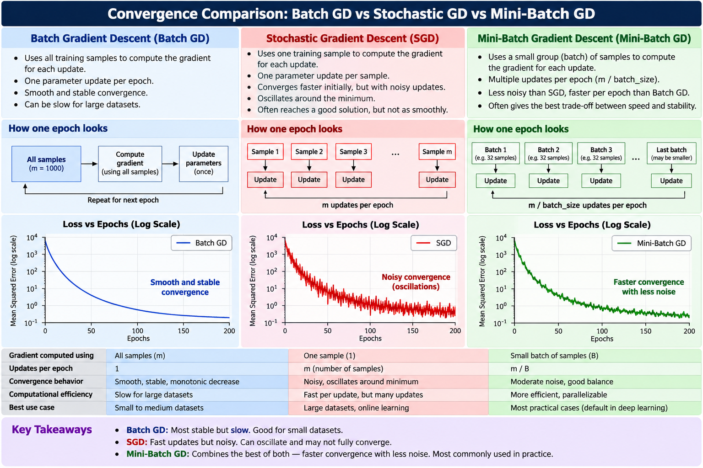

# 🎯 Gradient Descent Optimization for Linear Regression

A comprehensive collection of **Gradient Descent** variants for solving Linear Regression iteratively, built from scratch using only **Python** and **NumPy** — no scikit-learn for model training.

---

## 📌 Overview

**Gradient Descent** is an iterative optimization algorithm that finds the parameters that minimize a loss function (Mean Squared Error for regression) by taking repeated steps in the direction of the steepest descent.

Unlike the [closed-form solution](../closed_form), which computes optimal parameters in one analytical step, gradient descent:

- **Iteratively refines** parameters over multiple epochs
- **Scales better** to high-dimensional datasets (many features)
- Requires **hyperparameter tuning** (learning rate, epochs, batch size)
- Forms the foundation of **all modern deep learning optimizers** (Adam, RMSprop, AdaGrad)

---

## 🗂️ Gradient Descent Variants

| Variant                 | Samples per Update | Updates per Epoch   | Best For                           | Implementation                                                                          | Documentation                                                                       |
| :---------------------- | :----------------- | :------------------ | :--------------------------------- | :-------------------------------------------------------------------------------------- | :---------------------------------------------------------------------------------- |
| **Batch GD (Simple)**   | $n$ (all)          | 1                   | Small datasets, smooth convergence | [`GDSimLin.py`](batch_gd/simple_linear_regression_using_gradient_descent/GDSimLin.py)   | [View README](batch_gd/simple_linear_regression_using_gradient_descent/README.md)   |
| **Batch GD (Multiple)** | $n$ (all)          | 1                   | Medium datasets, deterministic     | [`GDLinReg.py`](batch_gd/multiple_linear_regression_using_gradient_descent/GDLinReg.py) | [View README](batch_gd/multiple_linear_regression_using_gradient_descent/README.md) |
| **Stochastic GD**       | 1 (single)         | $n$                 | Large/streaming data, fast updates | [`SGDRegressor.py`](stochastic_gd/SGDRegressor.py)                                      | [View README](stochastic_gd/README.md)                                              |
| **Mini-Batch GD**       | $b$ (batch)        | $\lceil n/b \rceil$ | Production systems, GPU training   | [`MBGDRegressor.py`](mini_batch_gd/MBGDRegressor.py)                                    | [View README](mini_batch_gd/README.md)                                              |

---

## 🧮 Core Mathematical Principle

All variants minimize the **Mean Squared Error (MSE)** loss function:

$$L(\beta_0, \beta) = \frac{1}{n} \sum_{i=1}^{n} (y_i - \hat{y}_i)^2$$

Where $\hat{y}_i = \beta_0 + \beta_1 x_{i1} + \beta_2 x_{i2} + \dots + \beta_k x_{ik} = X_i \beta + \beta_0$

### Gradient Descent Update Rule

Parameters are updated iteratively using the negative gradient:

$$\theta_{\text{new}} = \theta_{\text{old}} - \alpha \nabla_\theta L$$

Where:

- $\theta = [\beta_0, \beta_1, \ldots, \beta_k]$ are the parameters (intercept + coefficients)
- $\alpha$ is the **learning rate** (step size)
- $\nabla_\theta L$ is the gradient of the loss with respect to parameters

---

## 📊 Variant-by-Variant Comparison

### 1. Batch Gradient Descent (BGD)

**Updates using the entire training set** at each iteration:

$$\nabla_\beta L = -\frac{2}{n} X^T (y - \hat{y})$$

$$\nabla_{\beta_0} L = -\frac{2}{n} \sum_{i=1}^{n} (y_i - \hat{y}_i)$$

```python
# Full dataset prediction
Y_pred = X @ coef + intercept

# Full dataset gradient
error = Y - Y_pred
grad_coef = (-2 / n) * (X.T @ error)
grad_intercept = (-2 / n) * np.sum(error)

# Update
coef -= lr * grad_coef
intercept -= lr * grad_intercept
```

**Characteristics:**

- ✅ **Smooth convergence** — deterministic gradient direction
- ✅ **Stable** — low variance in parameter updates
- ⚠️ **Slow** — one update per full dataset pass
- ⚠️ **Memory intensive** — requires full dataset in memory

---

### 2. Stochastic Gradient Descent (SGD)

**Updates using one randomly selected sample** at each iteration:

$$\nabla_\beta L_i = -2 (y_i - \hat{y}_i) \cdot x_i$$

$$\nabla_{\beta_0} L_i = -2 (y_i - \hat{y}_i)$$

```python
# Shuffle dataset
indices = np.random.permutation(n)

for idx in indices:
    # Single sample prediction
    y_pred = X[idx] @ coef + intercept
    error = Y[idx] - y_pred

    # Single sample gradient (no averaging)
    grad_coef = -2 * error * X[idx]
    grad_intercept = -2 * error

    # Immediate update
    coef -= lr * grad_coef
    intercept -= lr * grad_intercept
```

**Characteristics:**

- ✅ **Fast per-epoch** — $n$ updates per epoch
- ✅ **Low memory** — only one sample needed at a time
- ✅ **Escapes local minima** — noise helps exploration
- ⚠️ **Noisy convergence** — high variance, oscillates around minimum
- ⚠️ **Poor GPU utilization** — single-sample operations

---

### 3. Mini-Batch Gradient Descent (MBGD) ⭐

**Updates using a small random batch of $b$ samples** (typically 32, 64, or 128):

$$\nabla_\beta L_{\text{batch}} = -\frac{2}{b} X_{\text{batch}}^T (y_{\text{batch}} - \hat{y}_{\text{batch}})$$

$$\nabla_{\beta_0} L_{\text{batch}} = -\frac{2}{b} \sum_{i \in \text{batch}} (y_i - \hat{y}_i)$$

```python
# Shuffle dataset
indices = np.random.permutation(n)

for start in range(0, n, batch_size):
    # Extract mini-batch
    batch_idx = indices[start:start + batch_size]
    X_batch = X[batch_idx]
    Y_batch = Y[batch_idx]

    # Batch prediction
    Y_pred = X_batch @ coef + intercept
    error = Y_batch - Y_pred

    # Batch gradient
    b = len(batch_idx)
    grad_coef = (-2 / b) * (X_batch.T @ error)
    grad_intercept = (-2 / b) * np.sum(error)

    # Update
    coef -= lr * grad_coef
    intercept -= lr * grad_intercept
```

**Characteristics:**

- ✅ **Balanced convergence** — moderate noise, stable direction
- ✅ **Excellent GPU utilization** — vectorized batch operations
- ✅ **Flexible** — batch size trades off speed vs stability
- ✅ **Industry standard** — used in PyTorch, TensorFlow, JAX
- ⚠️ **One more hyperparameter** — batch size needs tuning

---

## 📈 Visual Convergence Comparison



---

## ⚖️ Decision Matrix: Which Variant to Use?

| Scenario                        | Recommended Variant              | Reason                            |
| :------------------------------ | :------------------------------- | :-------------------------------- |
| **Dataset: < 1,000 samples**    | Batch GD                         | Full gradient is cheap to compute |
| **Dataset: 1k–100k samples**    | Mini-Batch GD ($b=32$ or $64$)   | Best speed/stability trade-off    |
| **Dataset: > 100k samples**     | Mini-Batch GD ($b=128$ or $256$) | GPU-efficient, scales well        |
| **Streaming / online learning** | Stochastic GD                    | One sample at a time              |
| **Research / debugging**        | Batch GD                         | Deterministic, reproducible       |
| **Production deep learning**    | Mini-Batch GD                    | Industry standard                 |

---

## 🔧 Shared Implementation Features

All gradient descent implementations in this module share:

### 1. **Feature Scaling (Standardization)**

```python
X_scaled = (X - mean) / std
```

Essential for convergence when features have different magnitudes.

### 2. **Random Shuffling**

```python
indices = np.random.permutation(n)
```

Ensures each epoch presents data in a different order (SGD, Mini-Batch).

### 3. **Early Stopping**

Training terminates if gradient magnitude or loss change drops below tolerance:

```python
if abs(previous_loss - current_loss) < tolerance:
    break
```

### 4. **Loss Tracking**

After each epoch, the full dataset loss is computed for convergence monitoring.

---

## 🚀 Quick Usage Examples

### Batch Gradient Descent

```python
from batch_gd.multiple_linear_regression_using_gradient_descent.GDLinReg import GDLinReg

model = GDLinReg(epochs=1000, lr=0.01, tolerance=1e-8, scale=True)
model.fit(X_train, Y_train)
y_pred = model.predict(X_test)
```

### Stochastic Gradient Descent

```python
from stochastic_gd.SGDRegressor import SGDRegressor

model = SGDRegressor(epochs=500, lr=0.01, tolerance=1e-4, scale=True)
model.fit(X_train, Y_train)
y_pred = model.predict(X_test)
```

### Mini-Batch Gradient Descent

```python
from mini_batch_gd.MBGDRegressor import MBGDRegressor

model = MBGDRegressor(batch_size=32, epochs=500, lr=0.01, tolerance=1e-4, scale=True)
model.fit(X_train, Y_train)
y_pred = model.predict(X_test)
```

---

## 📂 Directory Structure

```
gradient_descent/
│
├── README.md                                             # This file
│
├── batch_gd/
│   ├── simple_linear_regression_using_gradient_descent/
│   │   ├── README.md                                     # Simple BGD Documentation
│   │   ├── GDSimLin.py                                   # Simple BGD implementation
│   │   └── simple_linear_reg_using_gradient_descent.ipynb
│   └── multiple_linear_regression_using_gradient_descent/
│       ├── README.md                                     # Multiple BGD Documentation
│       ├── GDLinReg.py                                   # Multiple BGD implementation
│       └── multiple_linear_regression_using_gradient_descent.ipynb
│
├── mini_batch_gd/
│   ├── README.md                                         # Mini-Batch GD Documentation
│   ├── MBGDRegressor.py                                  # Mini-Batch GD implementation
│   └── mbgd_regressor_test.ipynb
│
└── stochastic_gd/
    ├── README.md                                         # Stochastic GD Documentation
    ├── SGDRegressor.py                                   # Stochastic GD implementation
    └── sgd_regressor_test.ipynb
```

---

## 🎯 Key Takeaways

1. **Batch GD** provides the most stable convergence but is slow on large datasets
2. **Stochastic GD** is fast per epoch but has noisy updates and poor hardware utilization
3. **Mini-Batch GD** is the practical choice — balances speed, stability, and GPU efficiency
4. **Feature scaling** is critical for all variants to converge properly
5. **Learning rate** is the most important hyperparameter — too high causes divergence, too low causes slow convergence
6. All modern deep learning frameworks (PyTorch, TensorFlow) default to **Mini-Batch GD**

---

## 📚 References

- [An Overview of Gradient Descent Optimization Algorithms — Sebastian Ruder](https://arxiv.org/abs/1609.04747)
- [Stochastic Gradient Descent — Léon Bottou](https://leon.bottou.org/projects/sgd)
- [CS231n: Optimization — Stanford](https://cs231n.github.io/optimization-1/)
- [Gradient Descent — Wikipedia](https://en.wikipedia.org/wiki/Gradient_descent)

---

**Built with ❤️ and pure mathematics**  
_Part of the [ML-From-Scratch](https://github.com/rudrapratap601/ML-From-Scratch) project_
